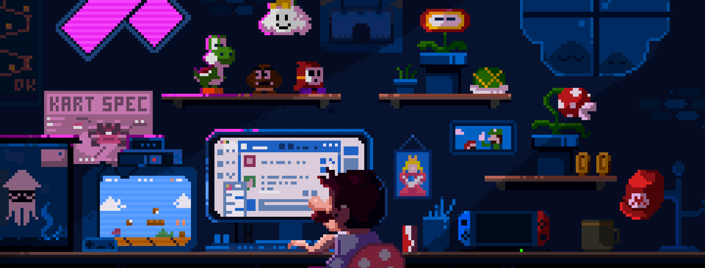

<!-- ========================= TOP BANNER ========================= -->
<p align="center">
  
</p>

<!-- ========================= HEADER ========================= -->
<h1 align="center">Hi 👋, I'm Varun PV</h1>
<h3 align="center">Computer Science Engineer • Software Developer • AI/ML Enthusiast</h3>

<p align="center">

</p>

<p align="center">

</p>

---

# 👨‍💻 ABOUT ME

```yaml
Name: Varun PV
Education: B.E Computer Science Engineering
University: Vidyavardhaka College of Engineering

Focus Areas:
  - Software Development
  - Artificial Intelligence
  - Full Stack Engineering
  - System Design

Core Computer Science:
  - Data Structures & Algorithms
  - Object Oriented Programming
  - DBMS
  - Operating Systems
  - Computer Networks
🚀 CURRENT PROJECT
Project: AI / ML Food Distribution Platform

Objectives:
  - Analyze food demand patterns
  - Optimize food allocation
  - Reduce food wastage

Technologies:
  - Python
  - Machine Learning
  - React
  - Node.js
🧠 PROGRAMMING LANGUAGES
<p align="center">    </p>
🌐 WEB DEVELOPMENT
<p align="center">      </p>
🤖 MACHINE LEARNING
<p align="center">      </p>
⚙️ TOOLS & TECHNOLOGIES
<p align="center">      </p>
📚 CURRENTLY LEARNING
• Advanced System Design
• Machine Learning Engineering
• Cloud Architecture
• Backend Optimization
💻 CODING PROFILES
<p align="center">    </p>
🌐 CONNECT WITH ME
<p align="center"> <a href="https://github.com/Varunpv2005">  </a> <a href="https://linkedin.com">  </a> <a href="mailto:yourmail@gmail.com">  </a> </p>
---

<p align="center">
⭐ From <b>Varun PV</b>
</p>
